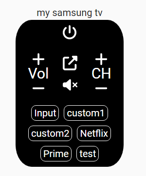
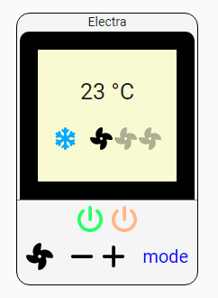

# Silent remote controls card for home assistant
* TV remote control
* AC remote control

### The card was tested with Broadlink, but should work for any other device/service.
## Demo



## HACS Installation (Preferred option with updates)
 - In the HACS Frontend, click the 3 dots in the upper right
 - Click 'Add Custom Repository'
 - Fill in the repo url https://github.com/silentbil/silent-remotes-card and choose 'Lovelace' category.
 - Install the custom card (should now appear in the Frontend)
 - HACS should automatically add the following to your resources:
```
url: /hacsfiles/silent-remotes-card/silent-remotes-card.js
type: Javascript Module
```

## Manual Installation
 - Download [silent-remotes-card.js](https://github.com/silentbil/silent-remotes-card/blob/main/dist/silent-remotes-card.js)
 - Copy to www/community/silent-remotes-card/ (create the silent-remotes-card directory first)
 - Add the following to your resources
```
url: /hacsfiles/silent-remotes-card/silent-remotes-card.js
type: Javascript Module
```

## Adding the Card to the Dashboard
Add a Manual card to the dashboard and enter the YAML to configure it as desired.

### Options
| Name | Description | Default | Required |  Values |
| --- | --- | --- | --- | --- |
| `iconSize` | Size of the buttons | `25` | No  | number|
| `remote` | remote control name | None | Yes | string |
| `commandsFilePath` | path of the file with the commands | None | Yes | `/folder/file-name.json` |
| `theme` | Theme of style | light | No | `light` or `dark` |
| `title` | Title of the remote | None | No |  string |
| `remoteType` | Type of remote control | None | Yes |  `tv` or `ac`  |
| `callServiceProps` | Service to call | None | Yes |  Object with: `domain` and `service`  |

## Command file structure

* The command file look like smartIr structure, meaning you can download the relevant commands from their device list and use as is.
* If not using smartIr, the file structre still need to fit the following

[TV example file with custom buttons](https://github.com/silentbil/silent-remotes-card/blob/main/command-examples/tv-command-example.json)<br />
[TV command file example from smartIR](https://github.com/smartHomeHub/SmartIR/blob/master/codes/media_player/1060.json)<br />
[AC command file example from smartIR](https://github.com/smartHomeHub/SmartIR/blob/master/codes/climate/1943.json)<br />


Check out [smartIR](https://github.com/smartHomeHub/SmartIR) and find your device commands.

### Add a command file:
create a json file inside the `/hacsfiles/silent-remotes-card/` for example tv.json and copy paste from the correct file from smartIR, or manually fill the commands.

## Examples
### example1: AC remote

```
type: custom:silent-remotes-card
remote: remote.broadlink_remote
commands: 1945.json
title: Electra
remoteType: ac
callServiceProps:
  domain: remote
  service: send_command
```
In this example, AC remote control will be created.
Remote device name is: `remote.broadlink_remote` and the service to send the command is: "remote.send_command".
the file with the commands is taken from `1945.json` found in the folder.

### example2: TV remote

```
type: custom:silent-remote
iconSize: 30
remote: remote.broadlink_remote
commands: 1061.json
theme: dark
title: my samsung tv
remoteType: tv
callServiceProps:
  domain: remote
  service: send_command
```
